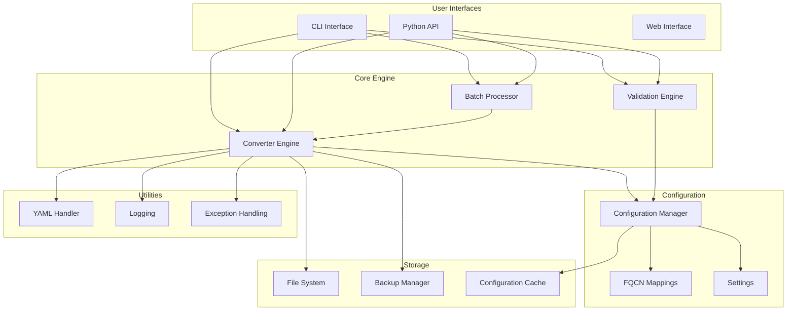

# Architecture Documentation

This document provides a comprehensive overview of the FQCN Converter architecture, design patterns, and implementation details.

## Overview

The FQCN Converter is designed as a modular, extensible system for converting Ansible playbooks from short module names to Fully Qualified Collection Names (FQCNs). The architecture emphasizes separation of concerns, testability, and maintainability.

## High-Level Architecture



## Package Structure

```
src/fqcn_converter/
├── __init__.py              # Public API exports
├── _version.py              # Version information
├── cli/                     # Command-line interface
│   ├── __init__.py
│   ├── main.py             # Main CLI entry point
│   ├── convert.py          # Convert command
│   ├── validate.py         # Validate command
│   └── batch.py            # Batch command
├── core/                    # Core conversion logic
│   ├── __init__.py
│   ├── converter.py        # Main conversion engine
│   ├── validator.py        # Validation engine
│   └── batch.py            # Batch processing
├── config/                  # Configuration management
│   ├── __init__.py
│   └── manager.py          # Configuration manager
├── utils/                   # Utility modules
│   ├── __init__.py
│   ├── yaml_handler.py     # YAML processing
│   └── logging.py          # Logging configuration
└── exceptions.py           # Exception hierarchy
```

## Core Components

### 1. Converter Engine (`core/converter.py`)

The heart of the system, responsible for the actual FQCN conversion.

#### Key Classes

##### `FQCNConverter`

**Purpose**: Main conversion engine with configurable mappings and robust error handling.

**Responsibilities**:
- Load and manage FQCN mappings
- Parse Ansible YAML files
- Identify and convert module names
- Handle backup creation
- Provide dry-run functionality

**Key Methods**:
- `convert_file()`: Convert a single file
- `convert_content()`: Convert YAML content string
- `convert_directory()`: Convert all files in directory

**Design Patterns**:
- **Strategy Pattern**: Different conversion strategies for different file types
- **Template Method**: Common conversion workflow with customizable steps
- **Builder Pattern**: Flexible configuration building

##### `ConversionResult`

**Purpose**: Encapsulates conversion operation results.

**Attributes**:
- Success/failure status
- Number of changes made
- Error and warning messages
- Original and converted content
- Processing metrics

#### Conversion Algorithm

```python
def convert_content(self, content: str) -> ConversionResult:
    """
    Conversion algorithm overview:
    
    1. Parse YAML content
    2. Identify Ansible structures (plays, tasks, handlers)
    3. Find module usage patterns
    4. Apply FQCN mappings
    5. Validate converted content
    6. Return results with metrics
    """
```

**Key Steps**:

1. **YAML Parsing**: Safe parsing with error handling
2. **Structure Analysis**: Identify plays, tasks, handlers, etc.
3. **Module Detection**: Find module usage using regex patterns
4. **Mapping Application**: Apply FQCN mappings with conflict resolution
5. **Content Reconstruction**: Rebuild YAML with FQCN modules
6. **Validation**: Ensure converted content is valid

#### Module Detection Strategy

```python
# Pattern matching for module detection
MODULE_PATTERNS = [
    r'^(\s*)-?\s*([a-zA-Z][a-zA-Z0-9_]*)\s*:',  # Direct module usage
    r'^(\s*)([a-zA-Z][a-zA-Z0-9_]*)\s*:',       # Task-level module
]

# Context-aware detection
def _is_module_usage(self, line: str, context: Dict) -> bool:
    """
    Determine if a line contains module usage based on:
    - Line content and structure
    - Surrounding context (task, play, etc.)
    - Indentation level
    - Known parameter patterns
    """
```

### 2. Validation Engine (`core/validator.py`)

Ensures proper FQCN usage and identifies conversion issues.

#### Key Classes

##### `ValidationEngine`

**Purpose**: Comprehensive FQCN compliance validation.

**Responsibilities**:
- Analyze Ansible files for FQCN compliance
- Generate detailed issue reports
- Calculate compliance scores
- Provide remediation suggestions

##### `ValidationResult` & `ValidationIssue`

**Purpose**: Structured validation results with actionable feedback.

#### Validation Algorithm

```python
def validate_content(self, content: str) -> ValidationResult:
    """
    Validation algorithm:
    
    1. Parse YAML content
    2. Identify all module usage
    3. Check against known FQCN patterns
    4. Generate issues with line numbers
    5. Calculate compliance score
    6. Provide remediation suggestions
    """
```

**Validation Checks**:
- Short module names that should use FQCN
- Invalid FQCN formats
- Unknown modules
- Deprecated module usage
- Collection availability

#### Scoring Algorithm

```python
def calculate_compliance_score(self, issues: List[ValidationIssue]) -> float:
    """
    Compliance scoring:
    
    Base Score = (FQCN Modules / Total Modules)
    Penalties:
    - Error: -0.1 per issue
    - Warning: -0.05 per issue
    - Info: -0.01 per issue
    
    Final Score = max(0.0, min(1.0, Base Score - Penalties))
    """
```

### 3. Batch Processor (`core/batch.py`)

Handles parallel processing of multiple Ansible projects.

#### Key Classes

##### `BatchProcessor`

**Purpose**: Efficient parallel processing with comprehensive reporting.

**Responsibilities**:
- Discover Ansible projects automatically
- Coordinate parallel worker processes
- Aggregate results and generate reports
- Handle individual project failures gracefully

#### Processing Architecture

```python
# Parallel processing with ThreadPoolExecutor
def process_projects(self, projects: List[str]) -> BatchResult:
    """
    Batch processing architecture:
    
    1. Project Discovery
       - Scan directory trees
       - Identify Ansible projects
       - Filter by patterns
    
    2. Parallel Processing
       - Create worker pool
       - Distribute projects to workers
       - Monitor progress
    
    3. Result Aggregation
       - Collect individual results
       - Calculate statistics
       - Generate summary report
    """
```

**Worker Process**:
```python
def _process_single_project(self, project_path: str) -> ConversionResult:
    """
    Single project processing:
    
    1. Initialize converter for project
    2. Discover Ansible files
    3. Convert files sequentially
    4. Aggregate project results
    5. Handle errors gracefully
    """
```

### 4. Configuration Manager (`config/manager.py`)

Manages FQCN mappings and converter settings.

#### Key Classes

##### `ConfigurationManager`

**Purpose**: Centralized configuration loading and management.

**Responsibilities**:
- Load default FQCN mappings
- Merge custom configurations
- Validate configuration data
- Provide fallback mechanisms

#### Configuration Hierarchy

```python
# Configuration precedence (highest to lowest)
CONFIGURATION_SOURCES = [
    "Command-line arguments",
    "Custom configuration file",
    "Project-specific config",
    "User home directory config",
    "Default built-in mappings"
]
```

#### Mapping Structure

```yaml
# Configuration file format
version: "1.0"
metadata:
  description: "FQCN mappings for Ansible modules"
  last_updated: "2025-01-01"

# Module mappings by collection
ansible_builtin:
  copy: "ansible.builtin.copy"
  file: "ansible.builtin.file"
  template: "ansible.builtin.template"

community_general:
  alternatives: "community.general.alternatives"
  composer: "community.general.composer"

# Collection dependencies
collection_dependencies:
  - name: "ansible.builtin"
    version: ">=2.12"
  - name: "community.general"
    version: ">=3.0.0"

# Validation patterns
validation_patterns:
  include:
    - "*.yml"
    - "*.yaml"
  exclude:
    - "**/test/**"
    - "**/.git/**"
```

## Design Patterns

### 1. Strategy Pattern

Used for different conversion and validation strategies:

```python
class ConversionStrategy(ABC):
    @abstractmethod
    def convert(self, content: str) -> ConversionResult:
        pass

class PlaybookConversionStrategy(ConversionStrategy):
    def convert(self, content: str) -> ConversionResult:
        # Playbook-specific conversion logic
        pass

class TaskFileConversionStrategy(ConversionStrategy):
    def convert(self, content: str) -> ConversionResult:
        # Task file-specific conversion logic
        pass
```

### 2. Builder Pattern

For flexible configuration building:

```python
class ConfigurationBuilder:
    def __init__(self):
        self._config = ConfigurationSchema()
    
    def with_mappings(self, mappings: Dict[str, str]) -> 'ConfigurationBuilder':
        self._config.mappings.update(mappings)
        return self
    
    def with_settings(self, settings: ConversionSettings) -> 'ConfigurationBuilder':
        self._config.settings = settings
        return self
    
    def build(self) -> ConfigurationSchema:
        return self._config
```

### 3. Observer Pattern

For progress tracking and event handling:

```python
class ProgressObserver(ABC):
    @abstractmethod
    def on_progress(self, completed: int, total: int, current: str) -> None:
        pass

class BatchProcessor:
    def __init__(self):
        self._observers: List[ProgressObserver] = []
    
    def add_observer(self, observer: ProgressObserver) -> None:
        self._observers.append(observer)
    
    def _notify_progress(self, completed: int, total: int, current: str) -> None:
        for observer in self._observers:
            observer.on_progress(completed, total, current)
```

### 4. Factory Pattern

For creating appropriate processors:

```python
class ProcessorFactory:
    @staticmethod
    def create_converter(config_path: Optional[str] = None) -> FQCNConverter:
        if config_path:
            return FQCNConverter(config_path=config_path)
        return FQCNConverter()
    
    @staticmethod
    def create_validator(strict_mode: bool = False) -> ValidationEngine:
        return ValidationEngine(strict_mode=strict_mode)
```

## Error Handling Architecture

### Exception Hierarchy

```python
FQCNConverterError (Base)
├── ConfigurationError
│   └── MappingError
├── ConversionError
│   └── YAMLParsingError
├── ValidationError
├── BatchProcessingError
└── FileAccessError
```

### Error Recovery Strategy

```python
class ErrorRecovery:
    """
    Error recovery mechanisms:
    
    1. Graceful Degradation
       - Continue with available mappings
       - Skip problematic files
       - Use fallback configurations
    
    2. User Guidance
       - Actionable error messages
       - Recovery suggestions
       - Alternative approaches
    
    3. Logging and Monitoring
       - Detailed error logging
       - Performance metrics
       - User feedback collection
    """
```

### Recovery Mechanisms

1. **Configuration Fallback**:
   ```python
   try:
       mappings = self._load_custom_config(config_path)
   except ConfigurationError:
       mappings = self._get_default_mappings()
   ```

2. **Batch Processing Resilience**:
   ```python
   for project in projects:
       try:
           result = self._process_project(project)
           successful_results.append(result)
       except ConversionError as e:
           failed_results.append((project, e))
           if not continue_on_error:
               break
   ```

3. **File-Level Recovery**:
   ```python
   try:
       converted_content = self._convert_content(content)
   except YAMLParsingError:
       # Skip file but continue processing
       return ConversionResult(success=False, errors=["Invalid YAML"])
   ```

## Performance Considerations

### Memory Management

1. **Streaming Processing**: Process files individually to minimize memory usage
2. **Lazy Loading**: Load configurations and mappings on demand
3. **Resource Cleanup**: Proper cleanup of temporary files and resources

### Parallel Processing

1. **Thread Pool**: Use ThreadPoolExecutor for I/O-bound operations
2. **Process Pool**: Use ProcessPoolExecutor for CPU-bound operations
3. **Worker Scaling**: Automatic worker count based on system resources

### Caching Strategy

```python
class ConfigurationCache:
    """
    Caching strategy:
    
    1. Configuration Caching
       - Cache loaded configurations
       - Invalidate on file changes
       - Memory-efficient storage
    
    2. Mapping Caching
       - Cache merged mappings
       - Share across converter instances
       - Configurable TTL
    
    3. Validation Caching
       - Cache validation results
       - Invalidate on content changes
       - Optional persistent cache
    """
```

## Testing Architecture

### Test Structure

```
tests/
├── unit/                    # Fast, isolated tests
│   ├── test_converter.py
│   ├── test_validator.py
│   └── test_config.py
├── integration/             # End-to-end workflow tests
│   ├── test_cli_integration.py
│   └── test_batch_processing.py
├── performance/             # Performance and load tests
│   └── test_benchmarks.py
├── fixtures/                # Test data and utilities
│   ├── sample_playbooks/
│   └── test_utilities.py
└── conftest.py             # Pytest configuration
```

### Test Patterns

1. **Arrange-Act-Assert**: Standard test structure
2. **Fixtures**: Reusable test data and setup
3. **Parameterized Tests**: Test multiple scenarios
4. **Mocking**: Isolate units under test
5. **Property-Based Testing**: Generate test cases automatically

### Test Categories

1. **Unit Tests**: Test individual components in isolation
2. **Integration Tests**: Test component interactions
3. **End-to-End Tests**: Test complete workflows
4. **Performance Tests**: Measure and validate performance
5. **Compatibility Tests**: Test across different environments

## Security Considerations

### Input Validation

1. **YAML Safety**: Use `yaml.safe_load()` to prevent code execution
2. **Path Validation**: Validate file paths to prevent directory traversal
3. **Content Sanitization**: Sanitize user-provided content

### File Operations

1. **Atomic Operations**: Use atomic file operations where possible
2. **Permission Checks**: Verify file permissions before operations
3. **Backup Safety**: Secure backup file creation and management

### Configuration Security

1. **Schema Validation**: Validate configuration against schema
2. **Safe Defaults**: Use secure default configurations
3. **Credential Handling**: Avoid storing credentials in configurations

## Extensibility

### Plugin Architecture

```python
class ConverterPlugin(ABC):
    @abstractmethod
    def get_mappings(self) -> Dict[str, str]:
        """Return additional FQCN mappings."""
        pass
    
    @abstractmethod
    def process_content(self, content: str) -> str:
        """Apply plugin-specific processing."""
        pass

class PluginManager:
    def __init__(self):
        self._plugins: List[ConverterPlugin] = []
    
    def register_plugin(self, plugin: ConverterPlugin) -> None:
        self._plugins.append(plugin)
    
    def get_all_mappings(self) -> Dict[str, str]:
        mappings = {}
        for plugin in self._plugins:
            mappings.update(plugin.get_mappings())
        return mappings
```

### Custom Validators

```python
class CustomValidator(ABC):
    @abstractmethod
    def validate(self, content: str) -> List[ValidationIssue]:
        """Perform custom validation."""
        pass

class ValidationEngine:
    def __init__(self):
        self._custom_validators: List[CustomValidator] = []
    
    def add_validator(self, validator: CustomValidator) -> None:
        self._custom_validators.append(validator)
```

## Future Enhancements

### Planned Features

1. **Web Interface**: Browser-based conversion interface
2. **IDE Integration**: Plugins for popular IDEs
3. **Real-time Validation**: Live validation as you type
4. **Machine Learning**: Intelligent module detection
5. **Cloud Integration**: Support for cloud-based Ansible

### Architecture Evolution

1. **Microservices**: Split into smaller, focused services
2. **Event-Driven**: Implement event-driven architecture
3. **API Gateway**: Centralized API management
4. **Containerization**: Full containerization support
5. **Monitoring**: Comprehensive monitoring and metrics

---

This architecture provides a solid foundation for the FQCN Converter while maintaining flexibility for future enhancements and extensions.