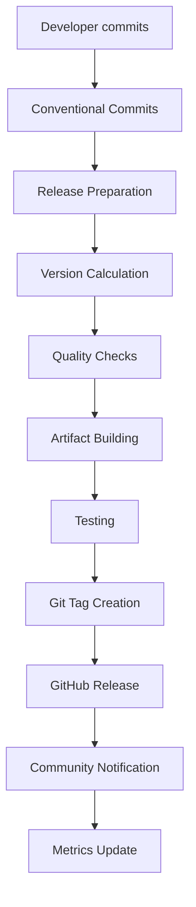

# Automated Release Process

This document describes the automated release workflow for FQCN Converter, including the tools, processes, and best practices for creating and managing releases.

## Overview

The FQCN Converter project uses a fully automated release process that handles:

- Version bumping based on conventional commits
- Changelog generation from commit history
- Quality assurance validation
- Artifact building and testing
- GitHub release creation
- Community notifications
- Documentation updates

## Release Workflow Architecture



## Release Types

### 1. Automatic Releases (Recommended)

**Triggered by**: Git tags pushed to the repository

**Process**:
1. Developer runs release preparation locally
2. Automated workflow validates and builds
3. GitHub release is created automatically
4. Community is notified

**Commands**:
```bash
# Prepare release (automatic version bump)
make release-prepare-auto

# Or prepare specific version type
make release-prepare-major    # Breaking changes
make release-prepare-minor    # New features
make release-prepare-patch    # Bug fixes
```

### 2. Manual Releases

**Triggered by**: Manual workflow dispatch in GitHub Actions

**Use Cases**:
- Hotfix releases
- Pre-releases (alpha, beta, RC)
- Emergency releases
- Custom version numbers

**Process**:
1. Navigate to GitHub Actions
2. Select "Release" workflow
3. Click "Run workflow"
4. Specify version and options

### 3. Pre-releases

**Types Supported**:
- Alpha: `v1.0.0-alpha.1`
- Beta: `v1.0.0-beta.1`
- Release Candidate: `v1.0.0-rc.1`

**Characteristics**:
- Marked as pre-release in GitHub
- Limited community notifications
- Testing and feedback focused
- Not recommended for production

## Release Preparation

### Local Preparation

The release preparation script automates local release tasks:

```bash
# Validate release readiness
make release-validate

# Calculate next version
make release-version

# Dry run (see what would happen)
make release-dry-run

# Prepare release locally
make release-prepare-auto

# Prepare and push immediately
make release-push
```

### Pre-Release Validation

Before any release, the following validations are performed:

**Git Status Checks**:
- Working directory is clean (no uncommitted changes)
- Currently on main branch
- All changes are pushed to remote

**Version Consistency**:
- Version files are synchronized
- No version conflicts exist
- Version follows semantic versioning

**Quality Assurance**:
- All tests pass
- Code quality checks pass
- Security scans are clean
- Documentation builds successfully

**Changelog Validation**:
- CHANGELOG.md format is correct
- Release notes can be generated
- Conventional commits are properly formatted

### Version Calculation

Version numbers are calculated automatically based on conventional commits:

**Commit Analysis**:
- `feat:` → Minor version bump
- `fix:` → Patch version bump
- `BREAKING CHANGE:` → Major version bump
- Other types → Patch version bump

**Manual Override**:
```bash
# Force specific version type
python scripts/prepare_release.py prepare --bump-type major
python scripts/prepare_release.py prepare --version 2.0.0
```

## Automated Workflow

### GitHub Actions Workflow

The release workflow (`.github/workflows/release.yml`) includes:

#### 1. Validation Phase
- Pre-release condition checks
- Version consistency validation
- Quality gate execution
- Changelog format validation

#### 2. Build Phase
- Python package building (wheel and sdist)
- Documentation generation
- Release notes creation
- Checksum generation

#### 3. Testing Phase
- Multi-platform installation testing
- Python version compatibility testing
- CLI and API functionality testing
- Checksum verification

#### 4. Release Phase
- GitHub release creation
- Asset attachment
- Release notes publication
- Milestone progress update

#### 5. Notification Phase
- Community discussion creation
- External notification preparation
- Metrics collection and archival

### Workflow Triggers

**Automatic Triggers**:
```yaml
on:
  push:
    tags:
      - 'v*'  # Any tag starting with 'v'
```

**Manual Triggers**:
```yaml
on:
  workflow_dispatch:
    inputs:
      version:
        description: 'Version to release'
        required: true
      prerelease:
        description: 'Mark as pre-release'
        type: boolean
```

## Release Artifacts

### Generated Artifacts

Each release produces the following artifacts:

**Python Packages**:
- `fqcn_converter-{version}-py3-none-any.whl` (wheel distribution)
- `fqcn-converter-{version}.tar.gz` (source distribution)

**Documentation**:
- `fqcn-converter-docs-{version}.tar.gz` (complete documentation)

**Release Information**:
- `RELEASE_NOTES_v{version}.md` (formatted release notes)
- `SHA256SUMS` (checksums for all artifacts)

**Validation**:
- All artifacts are tested on multiple platforms
- Checksums are verified
- Installation is validated

### Artifact Distribution

**GitHub Releases**:
- Primary distribution channel
- All artifacts attached to release
- Release notes and changelog included
- Download statistics tracked

**Future Distribution** (Planned):
- PyPI for pip installation
- Container registries for Docker images
- Package managers for system installation

## Community Notifications

### Automatic Notifications

**GitHub Discussions**:
- Announcement post created automatically
- Release highlights and installation instructions
- Links to documentation and support

**Future Integrations** (Planned):
- Slack/Discord notifications
- Email newsletter updates
- Social media announcements
- RSS feed updates

### Notification Content

**Release Announcements Include**:
- Version number and release type
- Key features and improvements
- Installation instructions
- Links to documentation and support
- Call for feedback and testing

**Pre-release Announcements**:
- Testing focus areas
- Known limitations
- Feedback collection methods
- Timeline for stable release

## Release Monitoring

### Metrics Collection

**Automated Metrics**:
- Release frequency and timing
- Artifact download statistics
- Installation success rates
- Community engagement levels

**Quality Metrics**:
- Build success rates
- Test failure analysis
- Security scan results
- Performance benchmarks

### Release Validation

**Post-Release Checks**:
- Installation testing across platforms
- Documentation accessibility
- Community feedback monitoring
- Issue tracking and resolution

**Success Criteria**:
- All artifacts install successfully
- No critical issues reported within 24 hours
- Community feedback is positive
- Documentation is accessible and accurate

## Troubleshooting

### Common Issues

**Release Preparation Fails**:
```bash
# Check git status
git status

# Validate version consistency
make version-validate

# Run quality checks
make quality-gate

# Check for uncommitted changes
git diff --staged
```

**Workflow Fails**:
```bash
# Check workflow logs in GitHub Actions
# Common issues:
# - Test failures
# - Build errors
# - Permission issues
# - Network timeouts
```

**Version Conflicts**:
```bash
# Reset version files
python scripts/version_manager.py validate

# Manual version update if needed
python scripts/version_manager.py bump --type patch
```

### Recovery Procedures

**Failed Release**:
1. Identify the failure point from workflow logs
2. Fix the underlying issue
3. Delete the failed tag if created: `git tag -d v1.0.0`
4. Re-run the release preparation
5. Push the corrected tag

**Rollback Release**:
1. Mark GitHub release as draft
2. Communicate issue to community
3. Prepare hotfix release
4. Update documentation with known issues

**Emergency Hotfix**:
```bash
# Create hotfix branch from release tag
git checkout -b hotfix/v1.0.1 v1.0.0

# Make minimal fix
# Commit with conventional format
git commit -m "fix: critical security issue"

# Prepare emergency release
python scripts/prepare_release.py prepare --bump-type patch --push
```

## Best Practices

### For Maintainers

**Release Planning**:
- Plan releases around milestone completion
- Coordinate with community for major releases
- Allow time for testing and feedback
- Communicate release schedules in advance

**Quality Assurance**:
- Never skip quality checks for releases
- Test releases in staging environments
- Validate all artifacts before publication
- Monitor community feedback post-release

**Communication**:
- Provide clear release notes
- Highlight breaking changes prominently
- Include migration guides when needed
- Respond to community feedback promptly

### For Contributors

**Commit Practices**:
- Use conventional commit format consistently
- Include clear descriptions and context
- Reference issues and pull requests
- Test changes thoroughly before committing

**Release Participation**:
- Test pre-releases and provide feedback
- Report issues promptly and clearly
- Help with documentation and examples
- Participate in release discussions

## Security Considerations

### Release Security

**Artifact Integrity**:
- All artifacts include SHA256 checksums
- Checksums are verified during testing
- Secure distribution channels used
- Audit trail maintained for all releases

**Access Control**:
- Release creation requires maintainer permissions
- Workflow secrets are properly secured
- Git tag creation is protected
- Artifact signing planned for future

### Vulnerability Response

**Security Release Process**:
1. Security issue identified and validated
2. Fix developed in private repository
3. Coordinated disclosure timeline established
4. Security release prepared and tested
5. Public release with security advisory
6. Community notification and guidance

**Emergency Procedures**:
- Hotfix releases can be created within hours
- Security advisories published immediately
- Affected versions clearly documented
- Migration guidance provided

## Future Enhancements

### Planned Improvements

**Release Automation**:
- Automatic dependency updates
- Performance regression detection
- Automated rollback capabilities
- Enhanced testing coverage

**Community Integration**:
- Release candidate testing program
- Community vote on release readiness
- Contributor recognition in releases
- User feedback integration

**Distribution Expansion**:
- PyPI automatic publishing
- Container image releases
- Package manager integration
- Cloud marketplace listings

### Continuous Improvement

**Process Evolution**:
- Regular workflow review and optimization
- Community feedback integration
- Tool and platform updates
- Best practice adoption

**Metrics and Analytics**:
- Release success rate tracking
- Community satisfaction measurement
- Performance impact analysis
- Adoption rate monitoring

This automated release process ensures consistent, high-quality releases while minimizing manual effort and reducing the potential for human error. The system is designed to be reliable, transparent, and responsive to community needs.